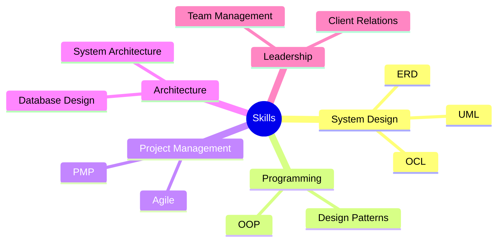

<!-- Animated Header -->

  

  <h3>Full-Stack Developer & Project Management Professional</h3>
  
  <!-- Profile Views Counter -->
  

## 🚀 About Me
A seasoned software engineer with proven expertise in web development and project management. Combining technical proficiency with strong leadership skills, I've successfully delivered **90+ projects** across corporate and freelance environments.

### 💼 Professional Highlights
- Former Technology Services Company Owner (2 years)
- PMP Certified Professional
- Team Lead with proven track record
- Expertise in Dashboard Development and Complex Web Applications
- Strong background in Database Architecture and Data Structures

## 🛠️ Technical Stack

<b>Backend Development</b>

 

  
  
  
  
  

<b>Frontend Development</b>

 

  
  
  
  

<b>Design & Development Tools</b>

 

  
  
  
  
  
  

## 📊 My Skills

  
  
  
  
  

## 🎯 Featured Projects

<table>
  <tr>
    <td width="50%">
      <h3 align="center">Dashboard Project</h3>
      

        
<strong>Python, Django, React & MySQL</strong> - Professional dashboard featuring real-time analytics and data visualization

        

          
        

      

    </td>
    <td width="50%">
      <h3 align="center">Wasender Customizing</h3>
      

        
<strong>PHP, JavaScript & PostgreSQL</strong> - Enterprise messaging system with customizable templates

        

          
        

      

    </td>
  </tr>
</table>

## 💪 Core Competencies

## 📈 GitHub Statistics

  

  
  

  

## 💭 Developer Philosophy

  
  
  <em>"Building solutions that make a difference, one line of code at a time."</em>

## 📫 Let's Connect
I'm available for challenging projects that require technical expertise and strategic thinking. Let's discuss how I can contribute to your project's success!

  
  <!-- Add your LinkedIn and other social links here -->

<!-- Footer -->

  

