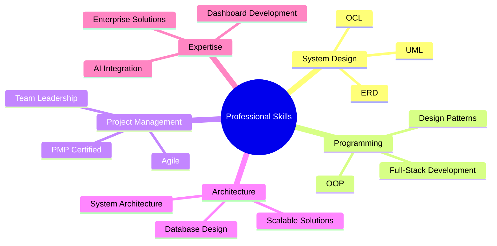

  

  <h3>Full-Stack Developer & Project Management Professional</h3>
  
  <!-- Profile Views Counter -->
  

### 🚀 About Me
A seasoned software engineer with proven expertise in web development and project management. Combining technical proficiency with strong leadership skills, I've successfully delivered **90+ projects** across corporate and freelance environments.

### 💼 Professional Highlights
- Former Technology Services Company Owner (2 years)
- PMP Certified Professional
- Team Lead with proven track record
- Expertise in Dashboard Development and Complex Web Applications
- Strong background in Database Architecture and Data Structures

## 🛠️ Technical Stack
### Backend Development

### Frontend Development

### Design & Development Tools

  
  
  
  
  
  

## 📈 Project Portfolio Overview
- 70+ Successful Corporate Projects
- 20+ Freelance Projects
- Specialized in AI-Enhanced Web Solutions
- Complex Dashboard Development
- Database Architecture Design

## 💪 Core Competencies

## 🌟 What Sets Me Apart
- End-to-end project delivery capability
- Strong analytical and problem-solving skills
- Excellence in multi-tasking and team coordination
- Proven track record in both corporate and freelance environments
- Experience in implementing AI-enhanced web solutions

## 📫 Let's Connect
I'm available for challenging projects that require technical expertise and strategic thinking. Let's discuss how I can contribute to your project's success!

  

  

---

  
  

