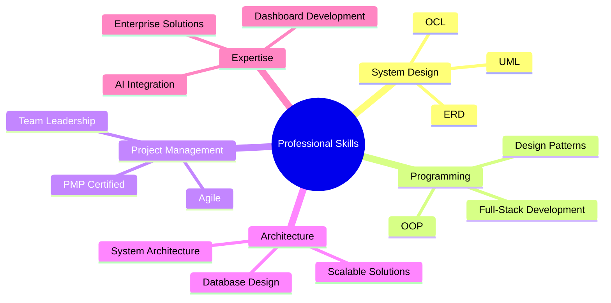

  <h1>👋 Hello, I'm Mahmoud Galal</h1>
  <h2>🚀 Senior Software Engineer | 📊 Project Management Expert</h2>
  <h3>💼 5+ Years Experience | ✅ 200+ Projects Delivered | 🎯 PMP Certified</h3>

  <h3>Senior Software Engineer (SSE) | Project Manager (PM) | Delivering Scalable & High-Impact Solutions</h3>
  
  <!-- Profile Views Counter -->
  

### 🚀 About Me
A seasoned software engineer with **5+ years** of proven expertise in web development and project management. Combining technical proficiency with strong leadership skills, I've successfully delivered **200+ projects** across corporate and freelance environments.

### 💼 Professional Highlights
- **5+ Years** of Software Development Experience
- PMP Certified Professional
- Team Lead with proven track record
- Expertise in Dashboard Development and Complex Web Applications
- Strong background in Database Architecture and Data Structures

## 🛠️ Technical Stack
### Backend Development

### Frontend Development

### Design & Development Tools

  
  
  
  
  
  

## 📈 Project Portfolio Overview
- 150+ Successful Corporate Projects
- 50+ Freelance Projects
- Specialized in AI-Enhanced Web Solutions
- Complex Dashboard Development
- Database Architecture Design

## 💪 Core Competencies

## 🌟 What Sets Me Apart
- End-to-end project delivery capability
- Strong analytical and problem-solving skills
- Excellence in multi-tasking and team coordination
- Proven track record in both corporate and freelance environments
- Experience in implementing AI-enhanced web solutions

## 📫 Let's Connect
I'm available for challenging projects that require technical expertise and strategic thinking. Let's discuss how I can contribute to your project's success!

  

---

  
### 📊 GitHub Activity

<table>
<tr>
<td width="50%">

#### 🔥 Contribution Stats
- **200+** Projects Completed
- **5+** Years of Experience
- **PMP** Certified Professional
- **Full-Stack** Development Expert

#### 💻 Current Focus
- AI-Enhanced Web Solutions
- Enterprise Dashboard Development
- Scalable System Architecture
- Team Leadership & Mentoring

</td>
<td width="50%">

#### 🛠️ Technical Expertise
- **Backend:** Python, PHP, Java (OpenJDK)
- **Frontend:** React, JavaScript, CSS3
- **Frameworks:** Django, Laravel, Flask
- **CSS Frameworks:** TailwindCSS, Bootstrap
- **Databases:** MySQL, PostgreSQL, SQLite
- **Tools:** Git, GitHub, Figma

#### 🎯 Specializations
- Project Management (PMP)
- Database Architecture Design
- Complex Web Applications
- Multi-platform Development

</td>
</tr>
</table>

### 🏆 Professional Achievements

